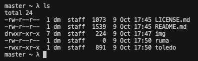
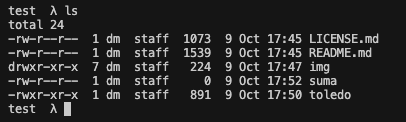

# :package: toledo

<h2 align="center">
  A fast and extremely minimal shell prompt with git tracking.
</h2>

<p align="center">
  
</p>

## Features

- Fast
- Minimal
- Lightweight
- Works on `BASH`, `ZSH`, `DASH`, `YASH`. Sorry `ASH`.
- Works on macOS but you need `oh-my-zsh` installed.

## Table of Contents

<!-- vim-markdown-toc GFM -->

* [What is it?](#What-Is-It)
* [Installation](#installation)
* [Prompt Character](#Prompt-Character)

<!-- vim-markdown-toc -->


## What Is It

`toledo` was an attempt to create a minimal prompt that had git functionality. It's a slew of borrowed ideas that worked well together.


## Installation

**Manual**

```
git clone https://github.com/mmatongo/toledo.git
```

``` .
# Inside your .bashrc, .zshrc, etc.
. /path/to/toledo
```


## Prompt Character

You can customize the prompt character by modifying the lambda `λ` sign on line [25](https://github.com/mmatongo/toledo/blob/master/toledo#L25) .

```
export PS1="\$(parse_git_branch) \$(parse_git_dirty) λ "
```


## Screenshots

#### Initial Screen


#### Untracked File [`?`]


#### Modified File [`*`]


#### Renamed File [`~`]


#### Deleted File


#### Switch Branch



## Git Prompts
Toledo has other git prompts such as;

[`!`] Branch is ahead.
<br>
[`+`] New file Added.


## MISC recommendations
As is `toledo` is pretty functional and can be used as your daily shell prompt,
however if you want extra functionality consider using it alongside `oh-my-zsh`
or anything similar.