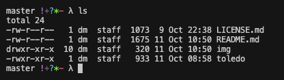
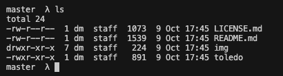
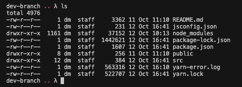

# :package: toledo

<h2 align="center">
  A fast and extremely minimal shell prompt with git tracking.
</h2>

<p align="center">
  
</p>

## Features

- Fast.
- Minimal.
- Lightweight.
- Works on `BASH`, `ZSH`, `DASH`, `YASH`. Sorry `ASH`.
- Works on macOS but you need `oh-my-zsh` installed.
- POSIX compliant (to a certain extent).

## Table of Contents

<!-- vim-markdown-toc GFM -->

- [What is it?](#What-Is-It)
- [Installation](#installation)
- [Prompt Character](#Prompt-Character)
- [Usage](#usage)
  - [`clone_repo` usage](#clone_repo-usage)

<!-- vim-markdown-toc -->

## What Is It

`toledo` was an attempt to create a minimal prompt that had git functionality. It's a slew of borrowed ideas that worked well together.

## Installation

**Manual**

```sh
git clone https://github.com/mmatongo/toledo.git
```

```sh
# Inside your .bashrc, .zshrc, etc.
. /path/to/toledo
```

## Prompt Character

You can customize the prompt character by modifying the lambda `λ` sign on line [51](https://github.com/mmatongo/toledo/blob/master/toledo#L62) .

```sh
export PS1="\$(parse_git_branch) \$(parse_git_dirty) λ "
```

## Usage

### The script also includes several useful Git aliases:

`gs`: `git status`
`gd`: `git diff`
`gc`: `git commit -m`
`gp`: `git push`
`gcb`:`git checkout -b`
`gco`: `git checkout`
`gf`: `git fetch`
`gcl`: `clone_repo (an alias for git clone)`

###

#### `clone_repo` usage

```sh
gcl <username> <repo_name> [<dir_name>] [-gh | -gl]
```

- <username>: the GitHub or GitLab username that owns the repository.
- <repo_name>: the name of the repository.
- <dir_name> (optional): the name of the directory where the repository will be cloned. If not provided, it will use the name of the repository.
  -gh or -gl (optional): specify whether to clone from GitHub (-gh) or GitLab (-gl). The default is GitHub.

## Screenshots

#### Initial Screen



#### Untracked File [`?`]


#### Modified File [`*`]


#### Renamed File [`~`]


#### Deleted File [`-`]


#### Switch Branch


#### Branch is ahead [`!`]


#### New file Added [`+`]


#### Branch is behind [`ˬˬ`]



## MISC recommendations

As is `toledo` is pretty functional and can be used as your daily shell prompt,
however if you want extra functionality consider using it alongside `oh-my-zsh`
or anything similar.
